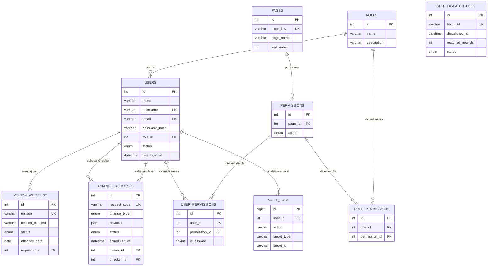

# Struktur Database — BNPT IPDR Vector Filtering Engine

MySQL 8 &middot; 10 tabel &middot; skema lengkap ada di `src/database/schema.sql`

## Diagram Relasi (ERD)

## Detail Tiap Tabel

### 1. `roles`
| Kolom | Tipe | Keterangan |
|---|---|---|
| id | INT, PK | |
| name | VARCHAR(50), UNIQUE | Admin / Maker / Checker / Viewer |
| description | VARCHAR(255) | |
| created_at, updated_at | DATETIME | |

### 2. `users`
| Kolom | Tipe | Keterangan |
|---|---|---|
| id | INT, PK | |
| name | VARCHAR(150) | Nama lengkap |
| username | VARCHAR(100), UNIQUE | Login ID |
| email | VARCHAR(150), UNIQUE, nullable | |
| password_hash | VARCHAR(255) | Hash bcrypt, **bukan** plaintext |
| role_id | INT, FK &rarr; roles.id | |
| status | ENUM('active','inactive') | |
| last_login_at | DATETIME, nullable | |
| created_at, updated_at | DATETIME | |

### 3. `pages`
| Kolom | Tipe | Keterangan |
|---|---|---|
| id | INT, PK | |
| page_key | VARCHAR(50), UNIQUE | `dashboard`, `whitelist`, `change-mgmt`, `processing`, `sftp`, `users` |
| page_name | VARCHAR(150) | Nama tampil di UI |
| sort_order | INT | Urutan di sidebar |

### 4. `permissions` — kunci granularitas per-halaman + per-tombol
| Kolom | Tipe | Keterangan |
|---|---|---|
| id | INT, PK | |
| page_id | INT, FK &rarr; pages.id | |
| action | ENUM('view','create','edit','delete') | |
| | UNIQUE(page_id, action) | 1 baris = 1 kombinasi halaman+aksi, misal `whitelist.create` |

### 5. `role_permissions` — default akses per role
| Kolom | Tipe | Keterangan |
|---|---|---|
| id | INT, PK | |
| role_id | INT, FK &rarr; roles.id | |
| permission_id | INT, FK &rarr; permissions.id | |
| | UNIQUE(role_id, permission_id) | |

### 6. `user_permissions` — override per user (di atas default role)
| Kolom | Tipe | Keterangan |
|---|---|---|
| id | INT, PK | |
| user_id | INT, FK &rarr; users.id | |
| permission_id | INT, FK &rarr; permissions.id | |
| is_allowed | TINYINT(1) | `1` = grant eksplisit, `0` = revoke eksplisit meski role punya |
| | UNIQUE(user_id, permission_id) | Tidak ada baris = ikut default role |

### 7. `msisdn_whitelist`
| Kolom | Tipe | Keterangan |
|---|---|---|
| id | INT, PK | |
| msisdn | VARCHAR(20), UNIQUE | Nomor asli (dienkripsi di level aplikasi) |
| msisdn_masked | VARCHAR(20) | `+62 812-****-0456`, untuk tampilan UI |
| status | ENUM('active','pending','removal') | |
| effective_date | DATE, nullable | |
| requester_id | INT, FK &rarr; users.id | Maker yang mengajukan |
| created_at, updated_at | DATETIME | |

### 8. `change_requests` — Scheduled Change Management (7 status)
| Kolom | Tipe | Keterangan |
|---|---|---|
| id | INT, PK | |
| request_code | VARCHAR(30), UNIQUE | `WLR-20260923-0012` |
| change_type | ENUM('add','remove') | |
| payload | JSON | Daftar MSISDN yang terdampak |
| status | ENUM('draft','submitted','under_review','approved','scheduled','applying','active','rejected') | 7 status alur + rejected |
| scheduled_at | DATETIME, nullable | Jadwal eksekusi |
| applied_at | DATETIME, nullable | |
| maker_id | INT, FK &rarr; users.id | |
| checker_id | INT, FK &rarr; users.id, nullable | |
| rejection_reason | VARCHAR(255), nullable | |
| created_at, updated_at | DATETIME | |

### 9. `sftp_dispatch_logs`
| Kolom | Tipe | Keterangan |
|---|---|---|
| id | INT, PK | |
| batch_id | VARCHAR(40), UNIQUE | `BATCH-20260925-1400` |
| dispatched_at | DATETIME | |
| matched_records | INT | |
| file_size_bytes | BIGINT | |
| destination | VARCHAR(255) | `sftp://sftp.bnpt.go.id/ipdr/inbound` |
| status | ENUM('pending','delivered','failed') | |
| duration_ms | INT, nullable | |
| error_message | VARCHAR(255), nullable | |

### 10. `audit_logs`
| Kolom | Tipe | Keterangan |
|---|---|---|
| id | BIGINT, PK | |
| user_id | INT, FK &rarr; users.id, nullable | NULL kalau aksi otomatis sistem |
| action | VARCHAR(100) | `APPROVE_CHANGE_REQUEST`, `LOGIN`, `DELETE_USER`, dst. |
| target_type | VARCHAR(50), nullable | `change_request`, `msisdn_whitelist`, `user` |
| target_id | VARCHAR(50), nullable | |
| detail | JSON, nullable | |
| ip_address | VARCHAR(45), nullable | |
| created_at | DATETIME | |

## Cara Resolve Hak Akses Efektif

1. Ambil semua baris `role_permissions` untuk role user &rarr; ini jadi **default**.
2. Cek `user_permissions` untuk user tsb:
   - Ada baris dengan `is_allowed = 1` &rarr; **tambahkan** permission itu meski role tidak punya.
   - Ada baris dengan `is_allowed = 0` &rarr; **hapus** permission itu meski role punya.
3. Hasil akhir (daftar string seperti `whitelist.create`, `change-mgmt.edit`) dikirim ke frontend lewat JWT saat login, dan divalidasi ulang di setiap endpoint backend lewat `PermissionGuard` — validasi di frontend cuma untuk UX (sembunyikan tombol), bukan pengaman sesungguhnya.

## Seed Data Default (sudah ada di `schema.sql`)

| Role | Akses default |
|---|---|
| **Admin** | Semua permission (24 kombinasi: 6 halaman &times; 4 aksi) |
| **Maker** | View semua halaman + Create di `whitelist` & `change-mgmt` |
| **Checker** | View semua halaman + Edit di `change-mgmt` (approve/reject) |
| **Viewer** | View semua halaman saja, tidak ada create/edit/delete |
